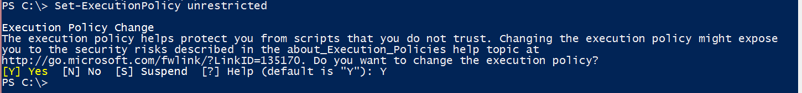
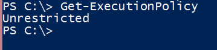
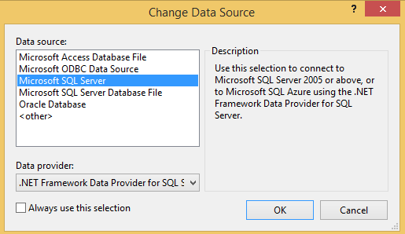
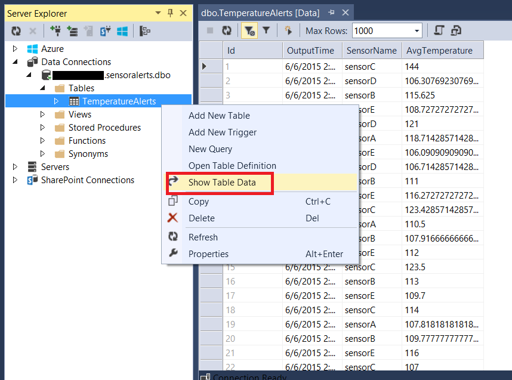

#Azure Stream Analytics One Click PowerShell#

One of the core value propositions of Azure Stream Analytics (ASA) is easily solving complex problems in less time and with less resource. This is a one click experience to demonstrate a SensorTag scenario using PowerShell script.

## Scenario ##
Contoso is a manufacturing company and using industrial automation, they have completely automated their manufacturing process. The machinery in this plant has sensors emitting streams of data in real time. In this scenario, a production floor manager needs to be alerted whenever a sensor, or specific set of sensors, report values exceeding a given threshold in a temporal window. To address this need, ASA can be configured to analyze the sensor data and send alerts to a SQL database. 


## Prerequisites for this demo ##

- **Azure Subscription**

- **Azure Power Shell** You will need to have the latest version of Azure PowerShell. You can follow the instructions [here](http://azure.microsoft.com/en-us/documentation/articles/install-configure-powershell/) to install it.
- **PowerShell execution-policy** must be set to Unrestricted as the demo PowerShell script is not digitally signed. Open Azure PowerShell window **As an Administrator**. Run “Set-ExecutionPolicy unrestricted”. When prompted, type “Y”.

Now **close Azure PowerShell window and reopen it**. Run Get-ExecutionPolicy to make sure the command worked.


- **Visual Studio** is required to see the output from a SQL Database

## Setup and Configuration ##
This sample application automates the process of creating an ASA Job and running it. To experience the scenario end to end, we need an EventHub, and a SQL Azure database. The powershell script will create these resources for you along with an ASA Job and start it. 
### Running the PS Script ###
1. Please download the ASAOneClick project from GitHub to a location in your computer.
2. Open the solution file in Visual Studio and **Build** it. 
2. Open Azure PowerShell and run setup.ps1 from \ASAOneClick folder. 
3. When prompted type Deploy. The script has two modes in which it runs. Deploy and Delete. Deploy will create the necessary resources like, EventHub, SQL Databases, ASA job and start the Job for you.

4. Once you choose deploy, it will open up a login screen prompting you to enter your Azure Credentials. 

5. If you have multiple subscriptions, you will have to select the appropriate subscription form the list. The script will then start creating all the resources required to run the demo. It will also create an ASA job and start it. Once it has completed, you should see something like this on your screen.


### Verifying your Stream Analytics Query ###
The script has created an ASA job and started it. You can go to the Azure Portal and see the job under Stream Analytics. The job name should be [sensoralerts```<name of your machine>```]
Click on the job and go to the Queries tab. You will see the Query as below.


### Sending Events to your ASA Job ###
Now you have your job created and running. All you need to do is start sending the data to see the output. When you build the project, it creates binaries for an EventGenerator located under **.\ASAOneClick\src\sensoralerts\SensorEventGenerator\SensorEventGenerator.exe**
The script will automatically configure the app with the connectionstring of the EventHub it has created. Run the exe to start sending events to EventHub.

If you have a TI SensorTag, you may also use the SensorTagToEventHub app to send events from your sensor to EventHub. The connectionstring of the EventHub is located in the file SensorEventGenerator.exe.config

### Verifying the Output ###
To see the output you can use Visual Studio.
Connect to the Azure database (the destination) from Visual Studio:

1. Open Visual Studio then click “Tools” and then “Connect to Database…” menu item.
2. If asked, select “Microsoft SQL Server” as a data source

3. The connection string for the output database is **located in the filesensoralerts-accounts.txt** in the folder from where you ran your PS Script. 
4. In the Server Name field paste the name of the SQL Server copied from the txt file (i.e. [```<serverName>```.database.windows.net])
4. In the Authentication field choose SQL Server Authentication
5. Enter the USER NAME and PASSWORD from the sensoralerts-accounts.txt file
6. Choose sensoralerts as the database
7. Click OK.
8. Open Server Explorer
9. You will see a table named TemperatureAlerts. Right click the table. Select “Show Table Data” to see the output of your job.


### Delete Resources created by the Script ###
You can stop the simulator by pressing Ctrl+C. To delete the Azure resources created, run the setup.ps1 script again and type **delete** when prompted. Follow the instructions to delete all the resources you have created earlier.