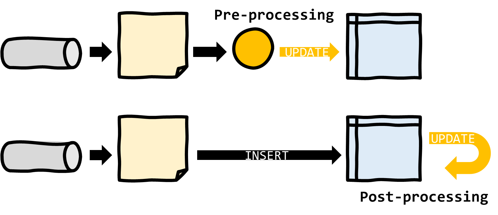
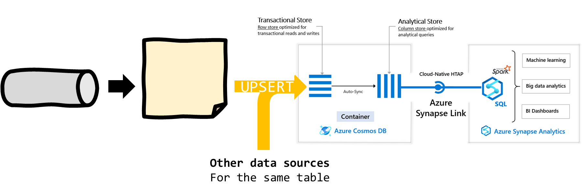

# Azure Stream Analytics - Update, upsert and merge patterns for SQL outputs

## Introduction

At the time of writing, [Azure Stream Analytics](https://docs.microsoft.com/en-us/azure/stream-analytics/) (ASA) only supports inserting rows to SQL outputs ([Azure SQL Databases](https://docs.microsoft.com/en-us/azure/stream-analytics/sql-database-output), and [Azure Synapse Analytics](https://docs.microsoft.com/en-us/azure/stream-analytics/azure-synapse-analytics-output)).

This article provides workarounds to enable UPDATE, UPSERT or MERGE capabilities on tables hosted in Azure SQL or Synapse SQL Pool.


## Approaches

From the perspective of the **destination database**, there are only two ways to approach the problem.

This is either via pre-processing, where an intermediary service will consume the stream from the ASA job and deliver the missing functions, or via post-processing, where a background task will operate once the data is inserted in the database.



Each approach offers different implementations that will be better suited for different scenarios:

|   |   |Azure SQL Database|Azure Synapse Analytics|
|---|---|---|---|
|Pre-Processing|   |   |   |
|   |Azure Functions|+++|-|
|   |Cosmos DB replacement|N/A|N/A|
|   |Cosmos DB Synapse Link|N/A|+++|
|Post-Processing|   |   |   |
|   |Triggers|+|N/A|
|   |Staging|+|+|

### Pre-processing

#### Azure Functions

Azure Functions is at the moment the only compute service that can be used as an [output of ASA](https://docs.microsoft.com/en-us/azure/stream-analytics/azure-functions-output). As such it's the prime candidate for pre-processing.


Here the UPDATE, UPSERT or MERGE capabilities will be hand coded in the Function script.

This approach works best for Azure SQL, as it generates a lot of traffic (1 T-SQL query per event). To leverage against Synapse SQL, a possible strategy is to merge the stream into a single partition of data, to be [switched](https://docs.microsoft.com/en-us/azure/synapse-analytics/sql-data-warehouse/sql-data-warehouse-tables-partition?toc=/azure/synapse-analytics/toc.json&bc=/azure/synapse-analytics/breadcrumb/toc.json#partition-switching) in the large fact table.

Sample code for a [C# script (.csx)](https://docs.microsoft.com/en-us/azure/azure-functions/functions-reference-csharp) function.

```CSHARP
#r "Newtonsoft.Json"

using System.Net;
using Microsoft.AspNetCore.Mvc;
using Microsoft.Extensions.Primitives;
using Newtonsoft.Json;

using System.Configuration;
using System.Data.SqlClient;

public static async Task<IActionResult> Run(HttpRequest req, ILogger log)
{
    log.LogInformation("C# HTTP trigger function processed a request.");

    // ASA can batch records, we need to deserialize into an array
    string requestBody = await new StreamReader(req.Body).ReadToEndAsync();
    dynamic dataArray = JsonConvert.DeserializeObject(requestBody);

    // Connecting to SQL via an environment variable
    var str = Environment.GetEnvironmentVariable("myConnectionString");
    using (SqlConnection conn = new SqlConnection(str))
    {
        conn.Open();

        for (var i = 0; i < dataArray.Count; i++)
        {
            string date = dataArray[i].date;
            string source = dataArray[i].source;
            int cnt_all =  dataArray[i].cnt_all;

            // Composing the query as a string
            var text = "UPDATE [myTable] SET" +
                    $"[date] = '{date}' ," +
                    $"[cnt_all] += {cnt_all} " +
                    $"WHERE source ='{source}';";

            log.LogInformation($"Running {text}");

            using (SqlCommand cmd = new SqlCommand(text, conn))
            {
                // Execute the command and log the # rows affected.
                var rows = await cmd.ExecuteNonQueryAsync();
                log.LogInformation($"{rows} rows were updated");
            }
        }

        conn.Close();
    }

    // Return a 200 OK to ASA to validate the batch
    return new OkResult();
}
```

##### Networking

Since at the moment ASA invokes [Azure Functions via HTTP triggers](https://docs.microsoft.com/en-us/azure/stream-analytics/azure-functions-output), it's recommended to deploy the ASA job in a cluster and define [private endpoints](https://docs.microsoft.com/en-us/azure/stream-analytics/private-endpoints). On the Function side, it will be necessary to use a [Function plan](https://docs.microsoft.com/en-us/azure/azure-functions/functions-networking-options#private-endpoint-connections) that supports private endpoints, and restrict access to [other inbound traffic](https://docs.microsoft.com/en-us/azure/azure-functions/functions-networking-options#inbound-access-restrictions).

#### Azure Cosmos DB

It's important to note that [the Cosmos DB output adapter supports UPSERT natively](https://docs.microsoft.com/en-us/azure/stream-analytics/stream-analytics-documentdb-output#upserts-from-stream-analytics). So for certain scenarios, it may make sense to completely replace the original SQL database destination by a Cosmos DB instance.


If the final destination is Synapse SQL Pool (not Azure SQL), it is possible to leverage [Azure Synapse Link for Azure Cosmos DB](https://docs.microsoft.com/en-us/azure/cosmos-db/synapse-link) to move data easily to Synapse once it's been ingested in Cosmos DB. This is a good option if the streaming data is the only source for the pipeline. If not, the other data sources will all need to be staged to Cosmos DB first for the UPSERT to make sense.



### Post-processing

#### Triggers

CREATE TRIGGER INSTEAD OF INSERT BEGIN UPDATE

#### Data staging

https://docs.microsoft.com/en-us/azure/synapse-analytics/sql/data-loading-best-practices
https://docs.microsoft.com/en-us/azure/synapse-analytics/sql-data-warehouse/sql-data-warehouse-tables-partition?toc=/azure/synapse-analytics/toc.json&bc=/azure/synapse-analytics/breadcrumb/toc.json#partition-switching

Including partition switching, ELT (to files, final state regenerated from immutable data)
Output to SQL table plus job that merge
Other Synapse loading strategy, see ETL best practices

## Performance considerations

https://docs.microsoft.com/en-us/azure/stream-analytics/stream-analytics-sql-output-perf